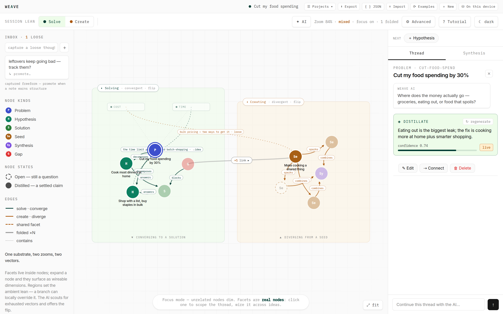

# Weave

[](./LICENSE)

**A tool for thinking through hard things.**

Most tools help you write down what you already think. Weave helps you *work out*
what you think — by laying a problem out as a picture you can question.

You break a problem into the ideas it rests on. You mark which ideas answer it,
which ones block it, and which are still just hunches. What you end up with isn't
a document — it's a map of your own reasoning, where you can see the weak spots.

**Everything stays on your computer.** There's no account, no sign-up, and no
server that stores your thinking. If you connect an AI, it runs on *your* key and
talks to *your* provider directly.



*The solve side (left, green) converges toward an answer. The create side (right,
amber) diverges from a spark. The dotted line between them is a shared dimension —
here, bulk pricing — reachable from both directions.*

## Supporting Weave

Weave is free and will stay free. If it comes to matter in how you think, you're
warmly invited to support its making — [buy me a coffee ☕](https://buymeacoffee.com/adhiet1810).
It's an invitation, offered gently and gratefully — never an obligation, and never
a gate placed in front of the tool.

The five promises Weave is built on are in the [manifesto](./MANIFESTO.md).

---

# Getting started

## The quickest way — nothing to install

1. On the GitHub page, click the green **Code** button → **Download ZIP**.
2. Unzip the file you downloaded.
3. Open the folder, then the **`public`** folder inside it.
4. Double-click **`index.html`**.

Weave opens in your web browser. A short welcome tour appears — click through it,
or skip it.

> **One limitation with this method:** the four built-in **example graphs won't
> load**. This isn't a bug in Weave — web browsers block pages opened straight
> from a folder from reading other files, as a security rule. Everything else
> works normally. To get the examples, use the method below.

## With the examples — one command

This needs **Node.js** or **Python** on your computer. Many people already have
one. (Not sure? Just try the commands — if you get "command not found", you don't
have it, and you can download Node from [nodejs.org](https://nodejs.org).)

**Step 1.** Open Terminal (Mac) or Command Prompt (Windows).

**Step 2.** Go into the unzipped folder. Type `cd ` (with a space), then drag the
folder onto the window and press Enter. You want the folder that *contains*
`public` — usually called `weave-web-main`.

**Step 3.** Run **one** of these:

| If you have… | Type this | Then open in your browser |
|---|---|---|
| **Node.js** | `npx --yes serve public` | `http://localhost:3000` |
| **Python** | `python3 -m http.server -d public 8080` | `http://localhost:8080` |

> ⚠️ **The two commands use different addresses.** `serve` uses port **3000**;
> Python uses **8080**. If the page doesn't load, check you're using the address
> that matches your command.

Leave that window open while you use Weave — it's what's serving the page. When
you're done, close it or press `Ctrl + C`.

---

# Your first few minutes

1. **Load an example.** Click **⟳ Examples** in the top bar and pick
   *Bedtime meltdowns*. A finished graph appears — it's your own editable copy,
   so feel free to change anything.
2. **Click a node.** The panel on the right shows its notes, its one-line summary
   ("distillate"), and how confident that summary is.
3. **Follow the shape.** Lines show how ideas relate: one idea *breaks down* into
   others, one *answers* another, and a red dashed node is a **gap** — something
   blocking you.
4. **Make your own.** Click **＋ New** for a blank project and start with one
   problem.

## What the colours and shapes mean

| Kind | What it is |
|---|---|
| **problem** | A question or goal you want to resolve |
| **hypothesis** | A claim that *might* be true — something you could argue with |
| **solution** | A concrete answer to a hypothesis |
| **gap** | A blocker: something outside your control standing in the way |
| **seed** | A loose idea, not attached to a problem yet |
| **synthesis** | Several ideas fused into one new whole |

A **dashed outline** means "not settled yet" — Weave is deliberately honest about
which of your thinking is still loose.

---

# Connecting an AI (completely optional)

Weave works fully without any AI. If you connect one, it can suggest how to break
a problem down, what might refute an idea, or what you're missing.

**How it works:** you bring your own key from an AI provider. Weave never
provides or resells AI — you pay your provider directly, usually a few cents.

1. Click **✦ AI** in the top bar.
2. Get a key from [openrouter.ai/keys](https://openrouter.ai/keys) (free to sign
   up; you add credit to use it).
3. Paste it in and click **Save**. The button shows **✦ AI ✓** when connected.

**Your key is stored only in your own browser** and is sent straight to your AI
provider. It never passes through any Weave server. Remove it any time with
**Turn AI off**.

---

# Where your work is saved

Your projects are saved **in your browser, on this computer**. They stay there
when you close the tab and come back later.

That means: they are **not** synced between devices, and they are **not** in the
cloud. It also means nobody else can read them.

### ⚠️ Please back up your work

Clearing your browser's history or site data **will delete your Weave projects**.
There's no copy anywhere else. So:

- **To back up:** click **{ } JSON**. A file downloads — keep it somewhere safe.
- **To restore, or move to another computer:** click **⬆ Import** and choose that
  file. It always comes in as a *new* project, so it can never overwrite
  something you already have.
- **⬇ Export** is different — that gives you a readable Markdown summary, handy
  for pasting into a document or another AI. Use **{ } JSON** for real backups.

---

# If something goes wrong

| What you see | What's happening | What to do |
|---|---|---|
| **"Could not load the vault"** | You have an older copy of Weave from before this was fixed. | Download the ZIP again from GitHub. |
| **The page won't load at all** | Wrong address for your command. | `serve` → `localhost:3000`. Python → `localhost:8080`. |
| **Examples are missing or the picker is empty** | You opened `index.html` by double-clicking. | Use the one-command method above. |
| **"command not found: npx"** | Node.js isn't installed. | Install [Node.js](https://nodejs.org), or use the Python command. |
| **"command not found: python3"** | Python isn't installed. | Use the Node command instead. |
| **A blank page** | The folder is wrong. | Make sure you're in the folder that *contains* `public`, not inside `public` itself. |
| **My projects vanished** | Browser data was cleared, or you're in a different browser. | Projects live per-browser. Restore from a `{ } JSON` backup if you have one. |

---
---

# For developers

Everything below is for people who want to self-host, modify, or deploy Weave.

## Run with Docker

```bash
docker build -t weave .
docker run --rm -p 8080:80 weave
```

## Architecture

```
public/
  index.html           the whole UI — graph canvas, threads, composer,
                       the local-first engine, and the BYOK AI client
  examples/*.json      the example graphs as static bundles (no DB needed)
functions/             OPTIONAL server backend (Cloudflare Pages Functions)
  api/graph.js         GET  /api/graph   → read D1, return the derived graph
  api/mutate.js        POST /api/mutate  → one write op, return the fresh graph
  api/export.js        GET  /api/export  → the portable JSON bundle
  api/projects.js      the project library
  api/ai.js            POST /api/ai      → optional server-side AI fallback
  _lib/derive.js       the derivation: folds, effective lean, couplings, scout
  _lib/auth.js         optional Bearer-token gate + vault resolution
migrations/*.sql       D1 schema, seed, projects, example library
wrangler.toml          Pages + D1 binding + default model
```

Weave is a **static site**. Point any host at **`public/`** with **no build
command** — Cloudflare Pages, Netlify, Vercel, GitHub Pages, S3, or nginx.

The **derivation is the contract**: `_lib/derive.js` (server) and its ported copy
in the browser produce an identical graph from identical rows, so both storage
backends behave the same.

### Storage modes

A **⛁** button in the project bar shows and switches the active store. Weave
auto-detects on first load: if the deployment answers `/api/graph` it uses the
server, otherwise it falls back to device storage. Switching never deletes
anything on either side.

On a static host you'll see **one `/api/graph` 404** in the browser console per
page load — that's the deliberate auto-detect probe. It's harmless.

## Optional server mode (Cloudflare Pages + D1)

Only needed for a hosted, multi-device instance with a shared database.

```bash
npm install
npm run db:init && npm run db:seed && npm run db:projects && npm run db:examples
npm run dev            # → http://localhost:8788
```

To deploy:

1. Create your **own** D1 database and put its id in `wrangler.toml`:

   ```bash
   npx wrangler d1 create weave
   ```

   > ⚠️ The `database_id` committed here points at the original author's
   > database. Replace it with your own — it is not a credential and grants no
   > access, but deploys won't find your data until you swap it.

2. Apply migrations remotely: `npm run db:init:remote`, `db:seed:remote`,
   `db:projects:remote`, `db:examples:remote`.
3. Cloudflare dashboard → *Workers & Pages* → *Pages* → *Connect to Git*. Build
   command: **none**. Output directory: **`public`**. Bind **`DB`** to your
   database under *Settings → Functions → D1 bindings*.

Migrations do **not** run on deploy — apply them with the `:remote` scripts.

## Write ops (`POST /api/mutate`, or the local engine)

| op | payload |
|---|---|
| `upsertNode` | `{ node: { id, kind, region, title, state?, distillate?, facets? } }` |
| `deleteNode` | `{ id }` — also removes its facets and incident edges |
| `addEdge` | `{ src, to_id, rel, from?, to_facet?, note? }` |
| `deleteEdge` / `deleteEdgeMatch` | `{ id }` / `{ src, to_id, rel }` |
| `addFacet` | `{ node_id, name, semantic?, distillate?, confidence? }` |
| `addCapture` / `deleteCapture` | `{ id, text }` / `{ id }` |
| `promote` | `{ captureId, node }` — capture → node in one step |
| `renameNode` / `editNode` / `changeKind` | node edits |
| `renameProject` / `clearVault` | project-level |
| `importVault` | `{ bundle }` — rebuild a vault from a portable bundle |

Each returns the full re-derived graph, so the client stays in sync.

## Contributing

Issues and pull requests are welcome. Please keep the two promises the project is
built on: **the graph stays on the user's device by default**, and **no user's key
or reasoning is ever sent to a Weave-controlled server**.

## License

[GNU AGPL-3.0](./LICENSE). You may use, study, modify and self-host Weave freely.
If you run a modified version as a network service, you must publish your changes.
